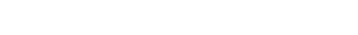

# Itô Protocol

## 1. What is Ito Protocol?

**Itô Protocol** is a **Stochastic AMM** an on‑chain Automated Market Maker that embeds **stochastic price modeling** to dynamically manage pricing, spreads, liquidity, and fees.  

Built on real-time Chainlink oracles, it simulates possible future prices via a **Geometric Brownian Motion (GBM)** model and adjusts its internal mechanics on-the-fly to better handle volatility and market risk.

---

## 2. What are Stochastic AMMs?

A **Stochastic AMM** extends traditional AMM models (like Uniswap) by incorporating **random price evolution** into their core design.  
- Instead of using deterministic formulas (e.g., constant-product), it uses probabilistic models to simulate future price movement.  
- By sampling a randomized “effective price” at each trade, it adapts parameters—such as fees, spreads, and liquidity routing—based on modeled risk, giving it trading-like adaptability.

---

## 3. What is GBM & its Finance Use?

**Geometric Brownian Motion (GBM)** is a mathematical model for asset price evolution, defined by the SDE:

- **μ** = drift (average growth)  
- **σ** = volatility (randomness)  
- **W_t** = Wiener process (continuous Brownian motion).

**Why GBM?**  
- Ensures **positivity** and log-normal distribution of prices  
- Well-known from the Black–Scholes model for options  
- Balances realism and mathematical simplicity for risk modeling

---

## 4. Discrete GBM in Ito Protocol

In practice, Itô Protocol uses a discrete snapshot at swap time:

- **Convexity Adjustment** (–σ²·Δt / 2): Corrects the log-normal skew so the expectation isn’t biased upward  
- **Volatility Scaling** (σ√Δt): Translates annual σ to the chosen time window Δt  
- **Random Shock** (Z₀ ~ N(0,1)): Applies random variation in line with GBM

Here, Δt is the time since the last volatility update—i.e., a single-use noise injection at each trade without simulating a full price path.

---

## 5. Component Overview

1. **Oracle Price (Chainlink)**: Provides live \(P_\text{market}\)  
2. **Volatility (σ)**: 30‑day historical volatility computed via Chainlink data feeds  
3. **Random Generator (Z₀)**: Provided per-trade by secure randomness (e.g., Chainlink Functions)  
4. **Pricing Module**: Computes EffectivePrice and informs swap rates  
5. **Fee Engine**: Dynamically sets trading fees based on current volatility and trade depth  
6. **Liquidity Manager**: Participants deposit two tokens; price-setting adjusts reserves using both oracle and volatile signals

---

## 6. Liquidity Mechanics

Price in the pool is determined by blending current pool ratio with oracle price, weighted by volatility:

- **currentRatio** = reserveA / reserveB  
- **oracleRatio** = 1 / Price (i.e. market reference)

When volatility is high, the pool ratio drives price; when low, the oracle anchors more tightly.

---

## 7. Why 30-Day Volatility?

- **Statistical Stability**: Offers more reliable measurement than noisy 24h windows  
- **Industry Standard**: Typically used in options pricing and financial risk
- **Mean-Reversion**: Volatility fluctuates; 30 days captures a balanced outlook  
- **Avoids Over-reaction**: Reduces erratic protocol behavior from temporary spikes

Using 24h volatility risks noise, manipulation, and unstable fee dynamics—it’s too short for reliable adjustment.

---

### Deployed Contract Addresses

All Contracts are deployed and verified on Avalanche Fuji Testnet.

| Contract | Address |
| --- | --- |
| DiamondCutFacet | 0xce27ADed623Ee8e44caC94B756f21f9A22A76644 |
| OwnershipFacet | 0x9a15bB682f36499e2359fe799a39296b1854Fc5F |
| ItoProxy | 0x90d7F4E09415FCC36fF860e56e40330B09E2dBD8 |
| Diamond Loupe | 0x90d7F4E09415FCC36fF860e56e40330B09E2dBD8 |
| Treasury | 0xf32713199d3CA492B8f202fd1C2Ea50B7b95febA |
| Liquidity | 0x5EB28617bD276DCA00bfD76047B85CE122f73F05 |
| Emergency | 0xb16dBe3d99aA60BbC8cD8ED89275FFa27F91C393 |
| Oracle | 0x98a76313c5F504f0EB6f9E57cdfb7e1ff5Ca6C73 |
| SAMM | 0x14DF2A4c1E70edad89476853a6cEC32Cb21e9300 |
| ItoInitializer | 0x36d9620916a78777Ea7c4194cAa80B97c4F1BCfA |
| ItoToken | 0x724a39308024ECc6f78121113F14a07383522E8F |
| Mock USD | 0x8B2421509a49bAC33A3c19133F60B3187Da34514 |
| Mock ETH | 0xD57622C4fa83ff905c3759cE43F4a0E34f812470 |
| Mock Volatility | 0x8B8d51005d88cCc1C66AfC8B613383DE519457bB |
| Pool Id | 0x0032627235a380cd |