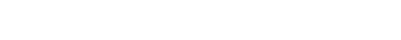
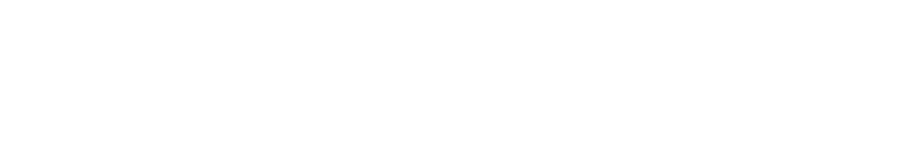
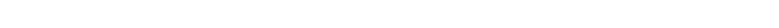
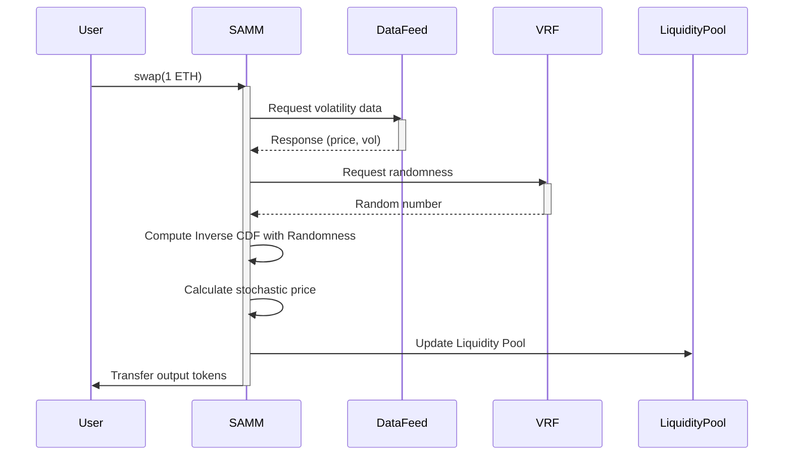

# Itô Protocol

Itô Protocol is a Stochastic AMM which simulates possible future prices via a Geometric Brownian Motion (GBM) model and adjusts its internal mechanics on-the-fly to better handle volatility and market risk.

## What is GBM & its Finance Use?

**Geometric Brownian Motion (GBM)** is a mathematical model for asset price evolution, defined by the SDE:

- **μ** = drift (average growth)  
- **σ** = volatility (randomness)  
- **W_t** = Wiener process (continuous Brownian motion).

**Why GBM?**  
- Ensures **positivity** and log-normal distribution of prices  
- Well-known from the Black–Scholes model for options  
- Balances realism and mathematical simplicity for risk modeling

---

---

## Discrete GBM in Ito Protocol

In practice, Itô Protocol uses a discrete snapshot at swap time:

- **Convexity Adjustment** (–σ²·Δt / 2): Corrects the log-normal skew so the expectation isn’t biased upward  
- **Volatility Scaling** (σ√Δt): Translates annual σ to the chosen time window Δt  
- **Random Shock** (Z₀ ~ N(0,1)): Applies random variation in line with GBM

Here, Δt is the time since the last volatility update—i.e., a single-use noise injection at each trade without simulating a full price path.

---

## Liquidity Mechanics

Price in the pool is determined by blending current pool ratio with oracle price, weighted by volatility:

- **currentRatio** = reserveA / reserveB  
- **oracleRatio** = 1 / Price (i.e. market reference)

When volatility is high, the pool ratio drives price; when low, the oracle anchors more tightly.

---

### Contract Addresses

The Protocol Follows Diamond Proxy Pattern. Various facets are deployed and managed by the `ItoProxy` contract.

All Contracts are deployed and verified on Avalanche Fuji Testnet.

| Contract | Citrea Testnet | Rootstock Testnet |
| --- | --- | --- |
| ItoRouter | 0xC94e5f5E4829b2b9AC8938E7Fe4695F6ec1B9145  | 0x71fBEc51bb16982455AbCc63Ca78b4fcd9E42684  |
| ItoToken | 0xE2567B2A7214877D395Dfa6ca72335644B26dC23  | 0xb8d4221efE13a25B06603Ad803A121571D1CDcAD  |
| ItoPool (ETH/USD) | 0x66e2d611763974a7645469bc179fA70e61CDC2F1  | 0xaAfd0C408bF921F522082867151b03EF94D43844  |
| Oracle | 0xc77ab300b6270dA732b137a592Ce54c468859dEf  |  0x321cDdD83465bFBa13ec1B16063739f151f976be |
| MockETH | 0xBCa528fCc1Ec19fC103Ea855BB3E371465eF74F0  | 0x1CADA5E3387e24869Cc92a47D90A94562E2307a9  |
| MockUSDC | 0x0e561F34e023330D56AfB3b5Af082D5AF1fBf022  | 0xf27E940daC4DfA1652Aef95614059925DAE9b273  |

## User Flow & Sequence Diagram

1. The SAMM contract sends a request to **Oracle** to fetch the current market price and 30-day realized volatility.
2. Oracle Feeds returns price and volatility data on-chain.
3. SAMM then Creates a Swap Request and requests a secure random seed, which responds with a verifiable random number.
4. Inside the SAMM logic, we apply an **inverse CDF** (normal quantile) function to that randomness to produce a standard normal term \(Z_0\).
5. With \(Z_0\), SAMM computes the **stochastic effective price** using the GBM-based formula (convexity + volatility + shock).
6. The AMM updates the **liquidity pool reserves** based on this effective price, executes the swap, and sends output tokens back to the user.

```mermaid
sequenceDiagram
    participant User
    participant SAMM
    participant DataFeed
    participant VRF
    participant LiquidityPool
    
    User->>SAMM: swap(1 ETH)
    activate SAMM
    SAMM->>DataFeed: Request volatility data
    activate DataFeed
    DataFeed-->>SAMM: Response (price, vol)
    deactivate DataFeed
    SAMM->>VRF: Request randomness
    activate VRF
    VRF-->>SAMM: Random number
    deactivate VRF
	SAMM->>SAMM: Compute Inverse CDF with Randomness
    SAMM->>SAMM: Calculate stochastic price
    SAMM->>LiquidityPool: Update Liquidity Pool
    SAMM->>User: Transfer output tokens
    deactivate SAMM
```
